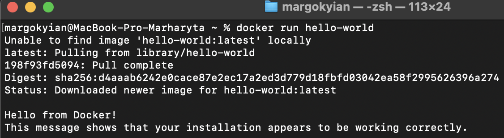
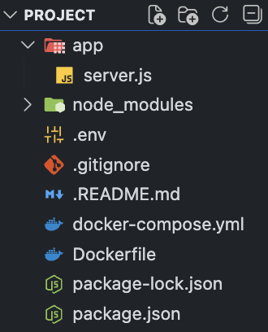
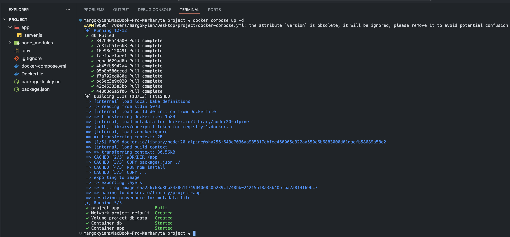
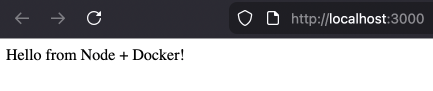
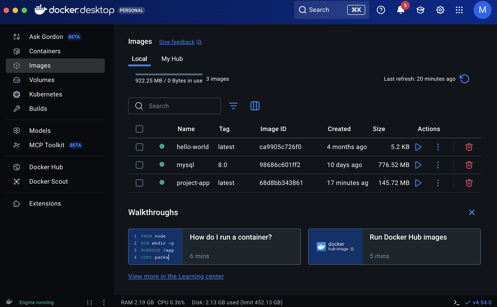
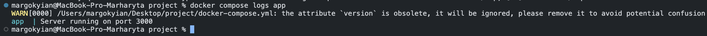
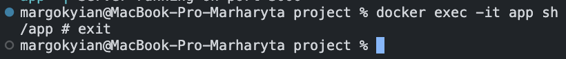
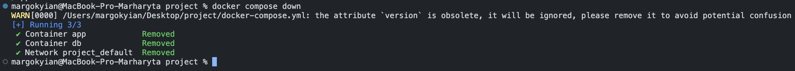

# Практична робота №7 – Docker Compose

## Виконали: ст. гр. ПД-21 Киян Маргарита / Солдатов Андрій («Черешня»)

Нижче наведено результати виконання практичної роботи з налаштування середовища для **(Node.js + Express)** за допомогою **Docker** та **Docker Compose**.  
Сервіс піднімається разом із контейнером бази даних, керування здійснюється через `docker compose`.

---

## Результати

---

## 1. Перевірка встановлення Docker

Скріншот демонструє успішний запуск тестового контейнера за допомогою команди: `docker run hello-world`.

---

## 2. Структура проєкту

Створена структура каталогу з розділенням коду застосунку та конфігурацій Docker.

---

## 3. Запуск контейнерів через Docker Compose

Контейнери (вебзастосунок + база даних) запускаються командою: docker `compose up -d`.

---

## 4. Перевірка роботи запущених контейнерів

Для перевірки стану контейнерів використовується команда: `docker ps`.

---

## 5. Перевірка доступу до вебзастосунку (localhost:3000)

Після запуску Docker Compose вебзастосунок генерації паролів стає доступним у браузері за адресою: `http://localhost:3000`.

---

## 6. Стан контейнерів у Docker Desktop

У Docker Desktop відображається стек сервісів, піднятий через docker compose.

---

## 7. Перегляд логів застосунку

Для аналізу роботи сервісу та пошуку помилок використовувалась команда: `docker compose logs app`.

---

## 8. Вхід у контейнер із застосунком

Для доступу всередину контейнера застосунку виконується команда: `docker exec -it app sh`.

---

## 9. Зупинка середовища

Для коректної зупинки й видалення контейнерів використовується команда: `docker compose down`.

---